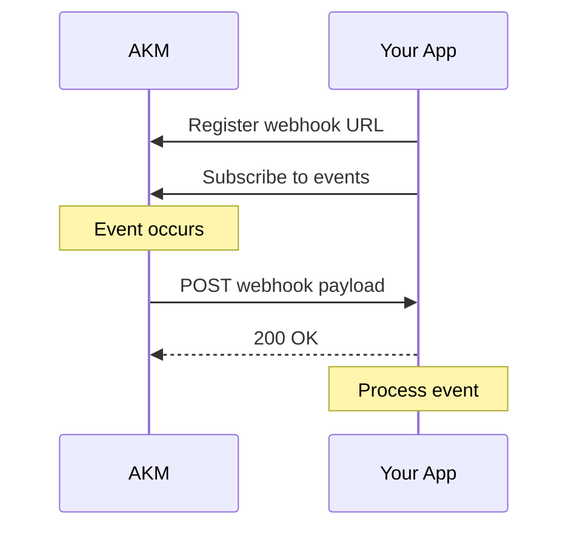

# Webhooks Documentation

Complete guide for implementing webhooks with AKM.

## Table of Contents

- [Overview](#overview)
- [Quick Start](#quick-start)
- [Webhook Registration](#webhook-registration)
- [Event Subscriptions](#event-subscriptions)
- [Event Types](#event-types)
- [Payload Format](#payload-format)
- [Security](#security)
- [Delivery & Retries](#delivery--retries)
- [Testing](#testing)
- [Best Practices](#best-practices)
- [Troubleshooting](#troubleshooting)

---

## Overview

Webhooks allow your application to receive real-time notifications when events occur in AKM. Instead of polling for changes, AKM pushes data to your endpoint when something happens.

### Use Cases

- 🔔 **Real-time notifications** - Get instant updates on API key events
- 🛡️ **Security monitoring** - Track unauthorized access attempts
- 📊 **Usage analytics** - Monitor API key usage patterns
- 🚨 **Alerting** - Trigger actions when alerts fire
- 📝 **Audit tracking** - Log all changes for compliance

### How It Works



---

## Quick Start

### 1. Register Webhook

```bash
POST /akm/v1/projects/{project_id}/keys/{key_id}/webhooks
Content-Type: application/json

{
  "url": "https://your-app.com/webhooks/akm",
  "secret": "your-webhook-secret-here",
  "enabled": true,
  "description": "Production webhook"
}
```

### 2. Subscribe to Events

```bash
PUT /akm/v1/projects/{project_id}/keys/{key_id}/webhooks/{webhook_id}/subscriptions/api_key.created
PUT /akm/v1/projects/{project_id}/keys/{key_id}/webhooks/{webhook_id}/subscriptions/rate_limit.exceeded
```

### 3. Implement Endpoint

```python
from fastapi import FastAPI, Request, HTTPException
import hmac
import hashlib

app = FastAPI()

WEBHOOK_SECRET = "your-webhook-secret-here"

@app.post("/webhooks/akm")
async def handle_akm_webhook(request: Request):
    # Get signature
    signature = request.headers.get("X-Webhook-Signature")
    if not signature:
        raise HTTPException(status_code=401, detail="Missing signature")
    
    # Get body
    body = await request.body()
    
    # Verify signature
    expected = hmac.new(
        WEBHOOK_SECRET.encode(),
        body,
        hashlib.sha256
    ).hexdigest()
    
    if not hmac.compare_digest(signature, expected):
        raise HTTPException(status_code=401, detail="Invalid signature")
    
    # Parse payload
    payload = await request.json()
    event_type = payload["event_type"]
    
    # Handle event
    if event_type == "api_key.created":
        print(f"New API key created: {payload['data']['key_id']}")
    elif event_type == "rate_limit.exceeded":
        print(f"Rate limit exceeded for key: {payload['api_key_id']}")
    
    return {"status": "received"}
```

### 4. Test It

```bash
POST /akm/v1/projects/{project_id}/keys/{key_id}/webhooks/{webhook_id}/test
```

You should receive a test event at your endpoint!

---

## Webhook Registration

### Create Webhook

```bash
POST /akm/v1/projects/{project_id}/keys/{key_id}/webhooks
Content-Type: application/json
X-API-Key: your_api_key

{
  "url": "https://your-app.com/webhooks/akm",
  "secret": "whsec_randomSecretKey123",
  "enabled": true,
  "description": "Production webhook for key monitoring",
  "headers": {
    "X-Custom-Header": "value"
  },
  "timeout_seconds": 30,
  "max_retries": 5
}
```

### Parameters

| Parameter | Type | Required | Description |
|-----------|------|----------|-------------|
| `url` | string | Yes | Your webhook endpoint URL (must be HTTPS) |
| `secret` | string | Yes | Secret key for HMAC signature verification |
| `enabled` | boolean | No | Enable/disable webhook (default: true) |
| `description` | string | No | Description for reference |
| `headers` | object | No | Custom headers to include in requests |
| `timeout_seconds` | integer | No | Request timeout (default: 30, max: 60) |
| `max_retries` | integer | No | Retry attempts (default: 5, max: 10) |

### Response

```json
{
  "id": 123,
  "api_key_id": 42,
  "url": "https://your-app.com/webhooks/akm",
  "enabled": true,
  "description": "Production webhook",
  "created_at": "2025-11-23T21:00:00Z",
  "updated_at": "2025-11-23T21:00:00Z",
  "subscriptions": []
}
```

### List Webhooks

```bash
GET /akm/v1/projects/{project_id}/keys/{key_id}/webhooks
```

### Get Webhook Details

```bash
GET /akm/v1/projects/{project_id}/keys/{key_id}/webhooks/{webhook_id}
```

### Update Webhook

```bash
PUT /akm/v1/projects/{project_id}/keys/{key_id}/webhooks/{webhook_id}
Content-Type: application/json

{
  "url": "https://new-url.com/webhooks/akm",
  "enabled": true
}
```

### Delete Webhook

```bash
DELETE /akm/v1/projects/{project_id}/keys/{key_id}/webhooks/{webhook_id}
```

---

## Event Subscriptions

After registering a webhook, subscribe to specific events.

### Subscribe to Event

```bash
PUT /akm/v1/projects/{project_id}/keys/{key_id}/webhooks/{webhook_id}/subscriptions/{event_type}
```

Example:
```bash
PUT /akm/v1/projects/1/keys/42/webhooks/123/subscriptions/api_key.created
```

### Unsubscribe from Event

```bash
DELETE /akm/v1/projects/{project_id}/keys/{key_id}/webhooks/{webhook_id}/subscriptions/{event_type}
```

### List Event Types

```bash
GET /akm/v1/webhooks/events/types
```

Response:
```json
{
  "event_types": [
    {
      "name": "api_key.created",
      "category": "api_keys",
      "description": "New API key created"
    },
    {
      "name": "rate_limit.exceeded",
      "category": "rate_limits",
      "description": "Rate limit exceeded"
    }
  ]
}
```

### Bulk Subscribe

Subscribe to multiple events at once:

```bash
POST /akm/v1/projects/{project_id}/keys/{key_id}/webhooks/{webhook_id}/subscriptions/bulk
Content-Type: application/json

{
  "event_types": [
    "api_key.created",
    "api_key.revoked",
    "rate_limit.exceeded"
  ]
}
```

---

## Event Types

### API Key Events

| Event Type | Description | Payload Includes |
|-----------|-------------|------------------|
| `api_key.created` | New API key created | Key ID, scopes, project |
| `api_key.updated` | API key modified | Key ID, changed fields |
| `api_key.revoked` | API key revoked | Key ID, reason |
| `api_key.expired` | API key expired | Key ID, expiration date |
| `api_key.rotated` | API key rotated | Old key ID, new key ID |

### Rate Limit Events

| Event Type | Description | Payload Includes |
|-----------|-------------|------------------|
| `rate_limit.exceeded` | Rate limit hit | Key ID, limit type, count |
| `rate_limit.warning` | Approaching limit (80%) | Key ID, percentage |
| `rate_limit.reset` | Rate limit window reset | Key ID, new window |

### Security Events

| Event Type | Description | Payload Includes |
|-----------|-------------|------------------|
| `ip_restriction.violated` | Unauthorized IP access | Key ID, IP, CIDR rules |
| `scope.violation` | Insufficient permissions | Key ID, required scope |
| `auth.failed` | Authentication failed | IP, reason, attempts |
| `suspicious.activity` | Unusual pattern detected | Key ID, pattern type |

### Alert Events

| Event Type | Description | Payload Includes |
|-----------|-------------|------------------|
| `alert.triggered` | Alert rule triggered | Alert ID, type, details |
| `alert.resolved` | Alert resolved | Alert ID, duration |

### System Events

| Event Type | Description | Payload Includes |
|-----------|-------------|------------------|
| `webhook.delivery.failed` | Webhook delivery failed | Webhook ID, error, retry |
| `audit.integrity.violation` | Audit log tampered | Log ID, hash mismatch |
| `config.updated` | Configuration changed | Config type, old/new |

### Project Events

| Event Type | Description | Payload Includes |
|-----------|-------------|------------------|
| `project.created` | New project created | Project ID, name |
| `project.updated` | Project modified | Project ID, changes |
| `project.deleted` | Project deleted | Project ID |

---

## Payload Format

All webhooks follow a consistent JSON format:

```json
{
  "event_id": "evt_1a2b3c4d5e6f",
  "event_type": "api_key.created",
  "timestamp": "2025-11-23T21:00:00Z",
  "api_key_id": 42,
  "project_id": 1,
  "data": {
    "key_id": 42,
    "key_prefix": "akm_abc123",
    "scopes": ["akm:users:read", "akm:users:write"],
    "created_by": "admin@example.com",
    "expires_at": "2026-11-23T21:00:00Z"
  },
  "correlation_id": "req_xyz789",
  "metadata": {
    "user_agent": "Mozilla/5.0...",
    "ip_address": "203.0.113.42"
  }
}
```

### Common Fields

| Field | Type | Description |
|-------|------|-------------|
| `event_id` | string | Unique event identifier (for deduplication) |
| `event_type` | string | Type of event (see Event Types) |
| `timestamp` | string | ISO 8601 timestamp (UTC) |
| `api_key_id` | integer | Related API key ID |
| `project_id` | integer | Related project ID |
| `data` | object | Event-specific data |
| `correlation_id` | string | Request correlation ID (for tracing) |
| `metadata` | object | Additional context |

### Example Payloads

#### API Key Created

```json
{
  "event_id": "evt_001",
  "event_type": "api_key.created",
  "timestamp": "2025-11-23T21:00:00Z",
  "api_key_id": 42,
  "project_id": 1,
  "data": {
    "key_id": 42,
    "key_prefix": "akm_abc123",
    "scopes": ["akm:users:read"],
    "description": "Mobile app key",
    "created_by": "admin@example.com"
  }
}
```

#### Rate Limit Exceeded

```json
{
  "event_id": "evt_002",
  "event_type": "rate_limit.exceeded",
  "timestamp": "2025-11-23T21:05:00Z",
  "api_key_id": 42,
  "project_id": 1,
  "data": {
    "limit_type": "per_minute",
    "limit": 1000,
    "current_count": 1001,
    "reset_at": "2025-11-23T21:06:00Z",
    "endpoint": "/api/users"
  }
}
```

#### IP Restriction Violated

```json
{
  "event_id": "evt_003",
  "event_type": "ip_restriction.violated",
  "timestamp": "2025-11-23T21:10:00Z",
  "api_key_id": 42,
  "project_id": 1,
  "data": {
    "ip_address": "198.51.100.50",
    "allowed_cidrs": ["203.0.113.0/24", "192.0.2.0/24"],
    "endpoint": "/api/users",
    "method": "GET"
  }
}
```

---

## Security

### HMAC Signature Verification

Every webhook includes an HMAC-SHA256 signature in the `X-Webhook-Signature` header.

#### How It Works

1. AKM computes HMAC using your webhook secret
2. Signature is sent in `X-Webhook-Signature` header
3. Your app recomputes HMAC with same secret
4. Compare signatures using constant-time comparison

#### Python Example

```python
import hmac
import hashlib

def verify_webhook_signature(payload_body: bytes, signature: str, secret: str) -> bool:
    """Verify webhook HMAC signature"""
    expected = hmac.new(
        secret.encode('utf-8'),
        payload_body,
        hashlib.sha256
    ).hexdigest()
    
    # Use constant-time comparison to prevent timing attacks
    return hmac.compare_digest(signature, expected)

# In your webhook handler
@app.post("/webhooks/akm")
async def handle_webhook(request: Request):
    body = await request.body()
    signature = request.headers.get("X-Webhook-Signature")
    
    if not verify_webhook_signature(body, signature, WEBHOOK_SECRET):
        raise HTTPException(status_code=401, detail="Invalid signature")
    
    payload = await request.json()
    # Process webhook...
```

#### Node.js Example

```javascript
const crypto = require('crypto');

function verifyWebhookSignature(body, signature, secret) {
  const expected = crypto
    .createHmac('sha256', secret)
    .update(body)
    .digest('hex');
  
  return crypto.timingSafeEqual(
    Buffer.from(signature),
    Buffer.from(expected)
  );
}

// Express.js handler
app.post('/webhooks/akm', express.raw({type: 'application/json'}), (req, res) => {
  const signature = req.headers['x-webhook-signature'];
  
  if (!verifyWebhookSignature(req.body, signature, WEBHOOK_SECRET)) {
    return res.status(401).send('Invalid signature');
  }
  
  const payload = JSON.parse(req.body);
  // Process webhook...
  
  res.status(200).send('OK');
});
```

#### Go Example

```go
package main

import (
    "crypto/hmac"
    "crypto/sha256"
    "encoding/hex"
    "io/ioutil"
    "net/http"
)

func verifyWebhookSignature(body []byte, signature string, secret string) bool {
    mac := hmac.New(sha256.New, []byte(secret))
    mac.Write(body)
    expected := hex.EncodeToString(mac.Sum(nil))
    
    return hmac.Equal([]byte(signature), []byte(expected))
}

func webhookHandler(w http.ResponseWriter, r *http.Request) {
    body, _ := ioutil.ReadAll(r.Body)
    signature := r.Header.Get("X-Webhook-Signature")
    
    if !verifyWebhookSignature(body, signature, WEBHOOK_SECRET) {
        http.Error(w, "Invalid signature", http.StatusUnauthorized)
        return
    }
    
    // Process webhook...
    w.WriteHeader(http.StatusOK)
}
```

### Best Practices

1. **Always verify signatures** - Never trust incoming webhooks without verification
2. **Use HTTPS** - Webhook URLs must use HTTPS
3. **Rotate secrets regularly** - Update webhook secrets periodically
4. **Validate payload structure** - Check for required fields
5. **Handle duplicates** - Use `event_id` for idempotency
6. **Log webhook events** - Keep audit trail of received webhooks

---

## Delivery & Retries

### Delivery Process

1. **HTTP POST** to your webhook URL
2. **30-second timeout** (configurable)
3. **2xx response required** for success
4. **Automatic retry** on failure

### Retry Policy

| Attempt | Delay | Total Elapsed |
|---------|-------|---------------|
| 1 | Immediate | 0s |
| 2 | 1 second | 1s |
| 3 | 2 seconds | 3s |
| 4 | 4 seconds | 7s |
| 5 | 8 seconds | 15s |
| 6 | 16 seconds | 31s |

**Exponential backoff** with max 5 retries by default.

### Failure Handling

After all retries fail:
- Webhook delivery marked as failed
- `webhook.delivery.failed` event fired (if subscribed)
- Manual retry available via API

### Manual Retry

```bash
POST /akm/v1/webhooks/deliveries/{delivery_id}/retry
```

### Delivery History

```bash
GET /akm/v1/projects/{project_id}/keys/{key_id}/webhooks/{webhook_id}/deliveries
```

Response:
```json
{
  "deliveries": [
    {
      "id": "del_123",
      "event_type": "api_key.created",
      "status": "success",
      "attempts": 1,
      "delivered_at": "2025-11-23T21:00:01Z",
      "response_code": 200,
      "response_time_ms": 145
    },
    {
      "id": "del_124",
      "event_type": "rate_limit.exceeded",
      "status": "failed",
      "attempts": 5,
      "last_attempt_at": "2025-11-23T21:05:31Z",
      "response_code": 500,
      "error": "Connection timeout"
    }
  ]
}
```

---

## Testing

### Test Endpoint

Send a test event to your webhook:

```bash
POST /akm/v1/projects/{project_id}/keys/{key_id}/webhooks/{webhook_id}/test
```

Test payload:
```json
{
  "event_id": "evt_test_123",
  "event_type": "webhook.test",
  "timestamp": "2025-11-23T21:00:00Z",
  "api_key_id": 42,
  "project_id": 1,
  "data": {
    "message": "This is a test webhook from AKM"
  }
}
```

### Local Development

Use tools like **ngrok** or **localtunnel** to expose your local server:

```bash
# Install ngrok
ngrok http 8000

# Your webhook URL
https://abc123.ngrok.io/webhooks/akm
```

### Mock Webhooks

Create a simple webhook receiver for testing:

```python
from fastapi import FastAPI, Request
import uvicorn

app = FastAPI()

@app.post("/webhooks/akm")
async def webhook_receiver(request: Request):
    payload = await request.json()
    print(f"Received: {payload['event_type']}")
    print(f"Data: {payload['data']}")
    return {"status": "received"}

if __name__ == "__main__":
    uvicorn.run(app, host="0.0.0.0", port=8000)
```

---

## Best Practices

### 1. Respond Quickly

Return `200 OK` immediately, then process asynchronously:

```python
import asyncio
from fastapi import BackgroundTasks

@app.post("/webhooks/akm")
async def handle_webhook(request: Request, background_tasks: BackgroundTasks):
    # Verify signature
    # ...
    
    payload = await request.json()
    
    # Return immediately
    background_tasks.add_task(process_webhook, payload)
    return {"status": "received"}

async def process_webhook(payload):
    # Long-running processing here
    await save_to_database(payload)
    await trigger_notifications(payload)
```

### 2. Handle Duplicates

Use `event_id` for idempotency:

```python
processed_events = set()  # Or use Redis/database

@app.post("/webhooks/akm")
async def handle_webhook(request: Request):
    payload = await request.json()
    event_id = payload["event_id"]
    
    # Check if already processed
    if event_id in processed_events:
        return {"status": "duplicate"}
    
    # Process webhook
    # ...
    
    # Mark as processed
    processed_events.add(event_id)
    return {"status": "received"}
```

### 3. Implement Retry Logic

Your endpoint should be idempotent and handle retries:

```python
@app.post("/webhooks/akm")
async def handle_webhook(request: Request):
    try:
        payload = await request.json()
        
        # Process with idempotent operations
        result = await process_event(payload)
        
        return {"status": "success", "result": result}
    
    except TemporaryError as e:
        # Return 5xx to trigger retry
        raise HTTPException(status_code=503, detail=str(e))
    
    except PermanentError as e:
        # Return 4xx to not retry
        raise HTTPException(status_code=400, detail=str(e))
```

### 4. Monitor Webhook Health

Track webhook delivery metrics:

```python
import time

webhook_metrics = {
    "total_received": 0,
    "successful": 0,
    "failed": 0,
    "avg_processing_time": 0
}

@app.post("/webhooks/akm")
async def handle_webhook(request: Request):
    start = time.time()
    webhook_metrics["total_received"] += 1
    
    try:
        # Process webhook
        payload = await request.json()
        await process_event(payload)
        
        webhook_metrics["successful"] += 1
        return {"status": "success"}
    
    except Exception as e:
        webhook_metrics["failed"] += 1
        raise
    
    finally:
        duration = time.time() - start
        webhook_metrics["avg_processing_time"] = (
            (webhook_metrics["avg_processing_time"] * (webhook_metrics["total_received"] - 1) + duration)
            / webhook_metrics["total_received"]
        )
```

---

## Troubleshooting

### Common Issues

#### 1. Signature Verification Fails

**Symptoms:**
- 401 errors in webhook logs
- "Invalid signature" errors

**Solutions:**
- Verify you're using the correct webhook secret
- Check you're computing HMAC on raw request body (before parsing JSON)
- Ensure using `utf-8` encoding
- Use constant-time comparison (`hmac.compare_digest`)

#### 2. Timeouts

**Symptoms:**
- Webhook deliveries marked as failed
- Timeout errors in logs

**Solutions:**
- Respond within 30 seconds
- Move long processing to background tasks
- Increase timeout in webhook configuration (max 60s)

#### 3. High Retry Rate

**Symptoms:**
- Same event delivered multiple times
- High retry count in delivery history

**Solutions:**
- Check your endpoint is returning 2xx status codes
- Verify endpoint is accessible (not behind firewall)
- Implement idempotency to handle retries gracefully

#### 4. Missing Events

**Symptoms:**
- Expected webhooks not received
- Gaps in event stream

**Solutions:**
- Verify webhook is enabled
- Check event subscriptions are active
- Review webhook delivery history for failures
- Ensure no firewall blocking requests from AKM IPs

### Debug Mode

Enable verbose logging:

```python
import logging

logging.basicConfig(level=logging.DEBUG)
logger = logging.getLogger(__name__)

@app.post("/webhooks/akm")
async def handle_webhook(request: Request):
    logger.debug(f"Headers: {request.headers}")
    
    body = await request.body()
    logger.debug(f"Body: {body}")
    
    signature = request.headers.get("X-Webhook-Signature")
    logger.debug(f"Signature: {signature}")
    
    # Verify and process...
```

### Webhook Inspector

Get detailed delivery information:

```bash
GET /akm/v1/webhooks/deliveries/{delivery_id}
```

Response includes:
- Request headers sent
- Response headers received
- Response body
- Timing information
- Error details

---

## Next Steps

- 📖 [Developer Guide](./DEVELOPER_GUIDE.md)
- 🔔 [Alerts Documentation](./ALERTS.md)
- 🔑 [API Keys Guide](./AUTHENTICATION.md)

---

## Support

Need help with webhooks? [Open an issue](https://github.com/ideiasfactory/akm/issues) with:
- Webhook configuration (redact secret)
- Event type subscribed to
- Error messages from logs
- Sample payload (if applicable)
